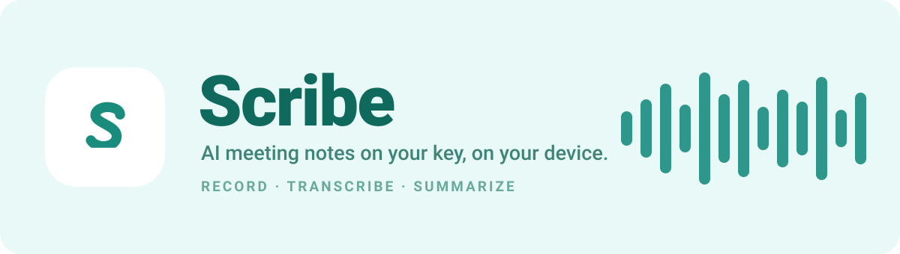

<p align="center">
  
</p>

<p align="center">
  
  
  
  
  
</p>

---

I kept losing the thread in meetings — half-listening while trying to scribble down what we actually decided, then paying a subscription to an app that quietly uploaded every conversation to servers I'd never see. Scribe is my answer to both problems.

Hit record. When you're done, Scribe transcribes the audio and writes you a summary — decisions, action items, the gist — in seconds. The recordings stay on your phone. The AI runs on a key *you* control. No subscription, no data hostage situation.

## What it does

- **Records** meetings with pause, resume, and mid-conversation bookmarks.
- **Transcribes** them with Groq's `whisper-large-v3-turbo` — fast enough that it's ready by the time you've put your phone down.
- **Summarizes** with `llama-3.3-70b` into something you'd actually forward to a colleague.
- **Detects the language** automatically, and can translate both the transcript and the summary into whatever language you read in.
- **Organizes** with folders — and a single meeting can live in several at once.
- **Schedules** meetings right inside the app, with a start time, end time, and description.
- **Reminds** you twice per meeting — a heads-up 5 minutes before, and again when it starts.
- **"Join now"** turns a scheduled meeting into a live recording with one tap, already named for you.
- **Exports** clean transcripts and summaries to PDF.
- **Searches** across everything you've ever recorded.

## What makes it different

**Your audio doesn't leave your device.** Recordings and transcripts are stored locally, scoped to your account. There's no cloud bucket quietly holding your conversations.

**Bring your own AI key.** Drop your own Groq key into Settings and you pay pennies per meeting instead of a monthly fee. Don't have one? Requests route through a Supabase Edge Function that holds the shared key **server-side only** — so it's never baked into the app binary where a decompiler could lift it. This was the whole reason the proxy exists: an API key shipped inside an APK is a key that's already leaked.

**No calendar app required.** Scheduling is entirely in-app. It behaves identically whether your phone ships with Google Calendar, Samsung Calendar, or nothing at all — a lesson learned the hard way after `device_calendar` returned empty data on real hardware.

## Under the hood

```
  record  ──►  local audio file (stays on device)
                     │
                     ▼
        transcription + summary request
                     │
        ┌────────────┴────────────┐
   your own key                 no key
        │                          │
        ▼                          ▼
   Groq (direct)      Supabase Edge Function
        │             (key hidden, auth-gated)
        └────────────┬─────────────┘
                     ▼
              Groq API  —  Whisper + Llama
```

- **Framework:** Flutter, with `provider` for state (proxy providers rebind on auth changes)
- **Storage:** local JSON + audio files, per signed-in user
- **Auth:** Supabase (email/password + email OTP)
- **AI:** Groq — Whisper for speech, Llama for summaries
- **Reminders:** `flutter_local_notifications` + `timezone`, anchored to the device's real timezone

## Getting started

You'll need Flutter (`^3.11`), a [Supabase](https://supabase.com) project, and a [Groq](https://console.groq.com) API key.

```bash
git clone https://github.com/RM1338/Scribe.git
cd Scribe
flutter pub get
```

Create a `.env` in the project root — note the Groq key is deliberately **not** here; it's either the user's own (entered in-app) or a server-side Supabase secret:

```env
SUPABASE_URL=https://your-project.supabase.co
SUPABASE_ANON_KEY=your-anon-key
```

Deploy the backend:

```bash
supabase db push --linked                 # schema
supabase functions deploy groq-transcribe # proxy: transcription
supabase functions deploy groq-chat       # proxy: summaries
supabase secrets set GROQ_API_KEY=gsk_...  # server-side only (optional if BYOK-only)
```

Then run it:

```bash
flutter run                  # dev
flutter build apk --release  # Android release
```

## Screens

<!--
  Screenshots go here once the first release is out.
  To capture them from a connected device/emulator:
    flutter screenshot --out docs/screens/record.png
  or record a demo GIF of a device screen with `scrcpy --record demo.mp4`
  then convert to gif. Drop the files in docs/screens/ and reference them below.

_Screenshots land here with the first public release._
-->

## Roadmap

- [ ] Cloud sync for recordings across devices
- [ ] Speaker diarization ("who said what")
- [ ] Shareable summary links
- [ ] Web build

Got an idea or hit a bug? [Open an issue](https://github.com/RM1338/Scribe/issues).

## Contributing

Fork it, branch it, open a PR. For anything sizeable, start an issue first so we can talk it through.

## License

No license yet — add one (MIT is a fine default) before you want others to reuse the code.

---

<p align="center">
  Built with Flutter and a healthy distrust of subscription meeting apps.<br>
  <sub>If Scribe is useful to you, a ⭐ is how other people find it.</sub>
</p>
